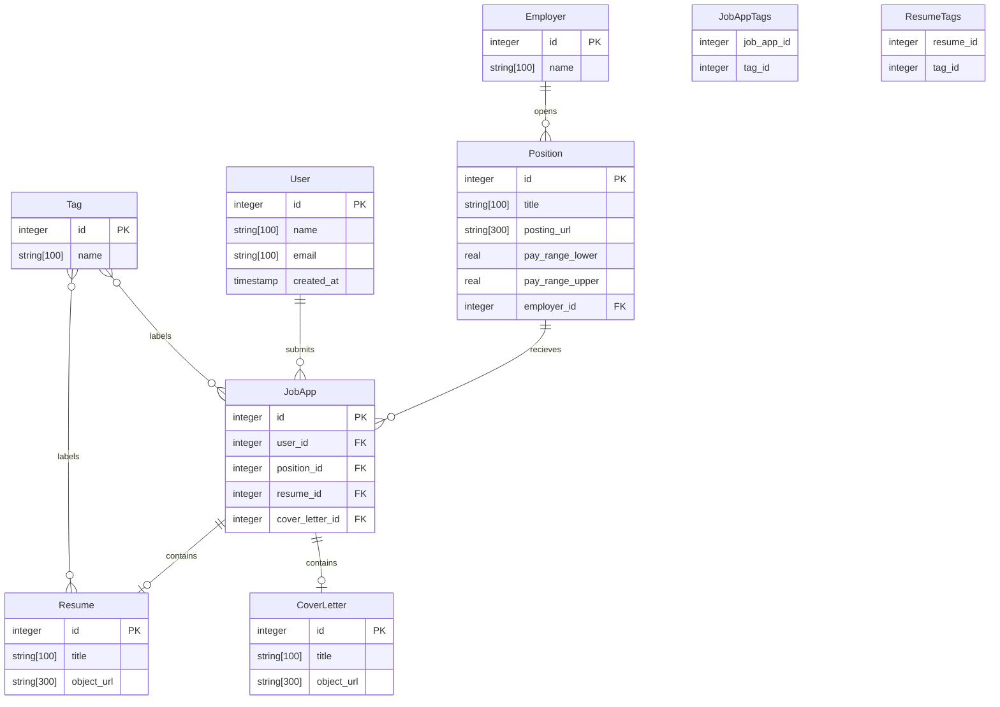

# Database

```mermaid
erDiagram
    User {
        integer id PK
        string[100] name
        string[100] email
        timestamp created_at
    }
    Employer {
        integer id PK
        string[100] name
    }
    Position {
        integer id PK
        string[100] title
        string[300] posting_url
        real pay_range_lower
        real pay_range_upper
        integer employer_id FK
    }
    JobApp {
        integer id PK
        integer user_id FK
        integer position_id FK
        integer resume_id FK
        integer cover_letter_id FK
    }
    Resume {
        integer id PK
        string[100] title
        string[300] object_url
    }
    CoverLetter {
        integer id PK
        string[100] title
        string[300] object_url
    }
    Tag {
        integer id PK
        string[100] name
    }
    JobAppTags {
        integer job_app_id
        integer tag_id
    }
    ResumeTags {
        integer resume_id
        integer tag_id
    }

    Employer    || -- o{ Position    : opens
    Position    || -- o{ JobApp      : recieves
    User        || -- o{ JobApp      : submits
    JobApp      || -- o| Resume      : contains
    JobApp      || -- o| CoverLetter : contains

    Tag         }o -- o{ JobApp      : labels
    Tag         }o -- o{ Resume      : labels
```
