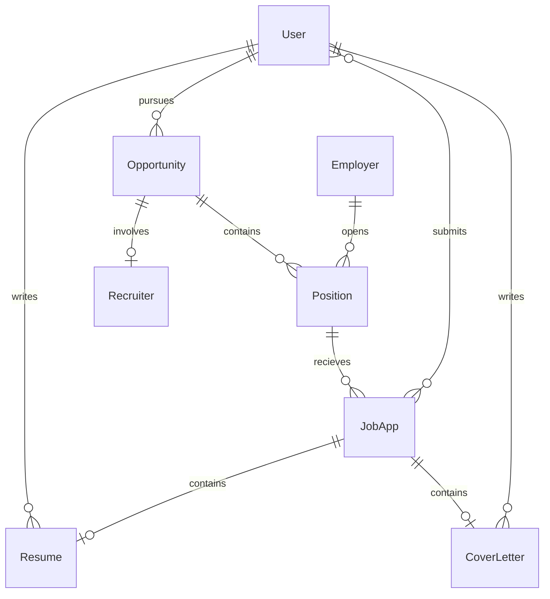

# Database

```mermaid
erDiagram
    User        || -- o{ Opportunity : pursues
    User        || -- o{ Resume      : writes
    Opportunity || -- o{ Position    : contains
    Employer    || -- o{ Position    : opens
    Opportunity || -- o| Recruiter   : involves
    Position    || -- o{ JobApp      : recieves
    JobApp      || -- o| Resume      : contains
    JobApp      || -- o| CoverLetter : contains
    User        }o -- o{ JobApp      : submits
    User        || -- o{ CoverLetter : writes
```
